<!-- ============================================================
     Rishabh Sharma — GitHub profile README
     Palette: GitHub dark tokens only (#0d1117 / #30363d / #e6edf3 / #39d353)
     contrib-heatmap.svg is generated daily by .github/workflows/update-profile-art.yml
     ============================================================ -->

  
  
  
  
  

---

### `$ whoami`

Final-year Computer Science undergrad at **BITS Pilani**, based in Gurugram.

I build **AI agents and automation systems** — the kind that run unattended and
survive contact with real use. Most of my time goes into LLM-driven tooling:
agent architectures, structured knowledge systems, and the unglamorous plumbing
that makes them reliable rather than merely impressive in a demo.

- Currently working on autonomous agent workflows and personal-infrastructure tooling
- Comfortable in **Python** and **TypeScript**; happiest somewhere near the systems layer
- Interested in anything that removes a recurring manual step from a real workflow
- Reach me at **iamcharizar@gmail.com**

 

---

### `$ ./contributions.sh`

  

---

### `$ cat stack.txt`

---

### `$ ls ~/projects`

> Pinned repositories appear above this section — this is the annotated version.

<table>
<tr>
<td width="50%" valign="top">

#### 🌲 Project name
Short one-line description of what it does and who it's for.

`Next.js` `TypeScript` `Supabase`

[Repo](#) · [Live](#)

</td>
<td width="50%" valign="top">

#### ⚡ Project name
Short one-line description of what it does and who it's for.

`Python` `LLM` `Automation`

[Repo](#) · [Live](#)

</td>
</tr>
<tr>
<td width="50%" valign="top">

#### 📊 Project name
Short one-line description of what it does and who it's for.

`TypeScript` `React`

[Repo](#) · [Live](#)

</td>
<td width="50%" valign="top">

#### 🧠 Project name
Short one-line description of what it does and who it's for.

`Python` `FastAPI`

[Repo](#) · [Live](#)

</td>
</tr>
</table>

---

### `$ git log --stat`

---

### `$ ./snake.sh`

  <picture>
    <source media="(prefers-color-scheme: dark)" srcset="https://raw.githubusercontent.com/iamcharizar-ai/iamcharizar-ai/output/snake.svg" />
    <source media="(prefers-color-scheme: light)" srcset="https://raw.githubusercontent.com/iamcharizar-ai/iamcharizar-ai/output/snake-light.svg" />
    
  </picture>

---

Heatmap regenerated daily by <a href="./.github/workflows/update-profile-art.yml">GitHub Actions</a>.

